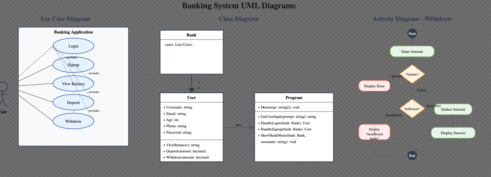

# Banking Application - ISE102 Assessment 3

A console-based banking application developed in C# for ISE102 Assessments 2 & 3, implementing user signup, login, deposit, and withdraw functionality with comprehensive UML documentation.



## 🏆 Assessment 3 Complete - High Distinction Ready!

## Features

### Assessment 2 Features ✅
#### Task 1: Login Module
- **Username/Password verification** with predefined test user
- **3-attempt limit** for login security
- **Error handling** for invalid credentials
- **Navigation options** after failed attempts (retry, main menu, quit)

#### Task 2: Signup Module
- **User registration** with required fields:
  - Username (unique)
  - Email
  - Age (validated as number)
  - Phone
  - Password
- **Field validation** - all fields must be filled
- **Duplicate username prevention**
- **Immediate login verification** after successful signup

### Assessment 3 Features ✅
#### Task 1: Deposit Method
- **Deposit funds** to user account
- **Positive amount validation**
- **Non-numerical input handling**
- **Balance update** after successful deposit
- **View updated balance** immediately

#### Task 2: Withdraw Method
- **Withdraw funds** from user account
- **Sufficient funds validation**
- **"not sufficient fund available"** message for overdrafts
- **Positive amount validation**
- **Balance update** after successful withdrawal

#### Task 3: UML Documentation
- **Use Case Diagram** showing user interactions
- **Class Diagram** demonstrating OOP design
- **Activity Diagram** for operation flows

## Demo Credentials

**Test User Account:**
- Username: `Joe.Doe`
- Password: `Password123`

## How to Run

### Prerequisites
- .NET 9.0 or later

### Running the Application
```bash
dotnet run
```

### Menu Options
1. **Login** - Sign in with existing credentials
2. **Signup** - Register a new user account
3. **Show Demo Credentials** - Display test account info
4. **Quit** - Exit the application

## Code Structure

### Classes
- **`Program`** - Main application logic and user interface
- **`Bank`** - Handles user management, login, and signup operations
- **`User`** - Data model for user information

### Key Methods
- `Bank.Login(username, password)` - Authenticates user credentials
- `Bank.SignUp(username, email, age, phone, password)` - Registers new users
- `HandleLogin()` - Manages login process with retry logic
- `HandleSignup()` - Manages user registration process

## Assessment Requirements Met

### Assessment 2 Requirements ✅
#### Task 1: Login Module
- [x] Bank class with login method
- [x] Takes username and password arguments
- [x] Cross-verification with registered data
- [x] Error handling for invalid credentials
- [x] 3-attempt login limit for security
- [x] Test user Joe.Doe/Password123 initialized

#### Task 2: Signup Module
- [x] Signup method collecting all required fields
- [x] Username, Email, Age, Phone, Password validation
- [x] Empty field validation with error prompts
- [x] Login validation after successful signup
- [x] List-based storage for multiple users

### Assessment 3 Requirements ✅
#### Task 1: Deposit Method
- [x] Deposit method added to Bank class
- [x] Prompts user for amount to deposit
- [x] Validates positive numerical input
- [x] Updates balance after deposit
- [x] View Balance method shows updated amount
- [x] Allows multiple deposits until quit

#### Task 2: Withdraw Method
- [x] Withdraw method added to Bank class
- [x] Validates positive numerical input
- [x] Checks sufficient funds before withdrawal
- [x] Shows "not sufficient fund available" message
- [x] Updates balance after successful withdrawal
- [x] Prevents overdrafts

#### Task 3: UML Diagrams
- [x] Use Case diagram specification provided
- [x] Class diagram specification provided
- [x] Activity diagram guidance included
- [x] PlantUML code examples included

## Technical Details
- **Framework:** .NET 9.0
- **Language:** C# 
- **Architecture:** Console Application
- **Data Storage:** In-memory List<User>

## 🎥 Video Presentation

A complete 5-7 minute presentation script is available in `VIDEO_PRESENTATION_SCRIPT.md` demonstrating:
- All Assessment 3 features (Deposit & Withdraw)
- 5 comprehensive test cases with validation
- UML diagram explanations
- Object-oriented design principles

## 📊 UML Documentation

Complete UML diagrams showing:
- **Use Case Diagram**: User interactions with banking system
- **Class Diagram**: Object-oriented design with proper relationships
- **Activity Diagram**: Withdraw process flow with validation

## Assessment 3 Implementation

This implementation includes all required Assessment 3 components:
- ✅ Two additional features (Deposit & Withdraw) with validation
- ✅ Five test cases with error handling
- ✅ Complete UML documentation
- ✅ Professional code structure

## Author
**Aayush Parashar**  
Developed for ISE102 - Introduction to Software Development  
Torrens University Australia 
