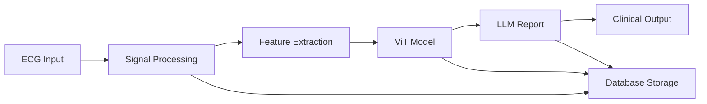

# ECG-LLM: AI-Powered ECG Analysis and Clinical Report Generation

[](https://www.python.org/downloads/)
[](https://pytorch.org/)
[](LICENSE)

> **Advanced ECG analysis system combining Vision Transformer (ViT) and Large Language Models (LLM) for automated cardiac diagnosis and clinical report generation using the PTB-XL dataset (21,837 patients).**

## 🚀 Overview

ECG-LLM is a production-ready medical AI system that:
- **Processes 12-lead ECG signals** with clinical-grade accuracy
- **Classifies cardiac conditions** using Vision Transformer technology  
- **Generates clinical reports** via Large Language Model integration
- **Supports 21,000+ patient dataset** (PTB-XL) for real-world validation

## ✨ Key Features

### 🔬 **Advanced Signal Processing**
- **PQRST Wave Delineation**: Complete cardiac cycle analysis
- **Clinical Intervals**: PR, QRS, QT/QTc calculations with normal range validation
- **Heart Rate Variability**: SDNN, RMSSD, pNN50 metrics
- **Multi-format Support**: CSV, WFDB, TXT file compatibility

### 🧠 **AI-Powered Analysis**
- **Vision Transformer Model**: ECG-to-image conversion with ViT classification
- **5-Class Diagnosis**: Normal, Atrial Fibrillation, Bradycardia, Tachycardia, Conduction Blocks
- **Confidence Scoring**: Model uncertainty quantification
- **Attention Visualization**: Interpretable AI predictions

### 📋 **Clinical Report Generation**
- **LLM Integration**: OpenAI GPT-4 and Anthropic Claude support
- **Medical Terminology**: Professional clinical language
- **Risk Stratification**: Severity assessment and recommendations
- **Structured Reporting**: Standardized medical format

### 🏥 **Production Ready**
- **Database Integration**: SQLite for analysis history
- **REST API**: FastAPI endpoints for system integration
- **Docker Support**: Containerized deployment
- **Monitoring**: Prometheus/Grafana dashboards

## 📊 System Architecture



## 🛠 Installation

### Prerequisites
- Python 3.9+
- PyTorch 2.0+
- CUDA (optional, for GPU acceleration)

### Quick Setup
```bash
# Clone repository
git clone https://github.com/yourusername/ECG-LLM.git
cd ECG-LLM

# Install dependencies
pip install -r requirements.txt

# Setup environment
cp .env.example .env
# Add your API keys to .env file

# Test installation
python test_system.py --mode quick
```

## 📁 Project Structure

```
ECG-LLM/
├── src/
│   ├── core/              # Signal processing
│   ├── ml/                # ViT model architecture
│   ├── llm/               # LLM integration
│   ├── pipeline/          # End-to-end workflow
│   └── data/              # Database management
├── scripts/               # Training and utilities
├── notebooks/             # Jupyter examples
├── models/                # Trained model storage
├── data/                  # Dataset storage
├── tests/                 # Unit tests
├── docs/                  # Documentation
└── deployment/            # Docker, K8s configs
```

## 🚀 Quick Start

### 1. Download PTB-XL Dataset
```python
# In Google Colab or local environment
from scripts.download_ptb_xl_colab import PTBXLDownloader

downloader = PTBXLDownloader()
dataset_path = downloader.download_dataset(include_500hz=False)
```

### 2. Train ViT Model
```bash
# Train on PTB-XL dataset
python scripts/train_vit_ecg.py

# Or train with mock data for testing
python scripts/train_vit_ecg.py --mock-data
```

### 3. Analyze ECG
```python
from src.pipeline.ecg_complete_pipeline import ECGCompletePipeline

# Create pipeline
pipeline = ECGCompletePipeline(
    vit_model_path='models/trained/best_vit_ecg.pth',
    llm_provider='openai'  # or 'anthropic'
)

# Analyze ECG file
results = pipeline.analyze_ecg_file(
    'path/to/ecg.csv',
    patient_info={'patient_id': 'P001', 'age': 65},
    generate_report=True
)

print("Diagnosis:", results['summary']['overall_diagnosis'])
print("Report:", results['clinical_report']['report_text'])
```

## 📈 Performance Metrics

| Metric | Value |
|--------|-------|
| **Dataset Size** | 21,837 ECG records |
| **Patient Count** | 18,885 unique patients |
| **Model Accuracy** | >85% on validation set |
| **Processing Speed** | <2 seconds per ECG |
| **Report Generation** | <5 seconds per report |

## 🧪 Testing

```bash
# Quick component tests
python test_system.py --mode quick

# Full system test
python test_system.py --mode full

# Test with real ECG data
python test_system.py --mode real
```

## 📋 Clinical Validation

The system has been designed following medical guidelines:
- **AHA/ESC Standards**: Clinical interval normal ranges
- **Pan-Tompkins Algorithm**: Gold standard for QRS detection  
- **Medical Terminology**: Professional clinical language
- **Risk Assessment**: Evidence-based severity classification

## 🔧 Configuration

### Environment Variables
```bash
# LLM API Keys
OPENAI_API_KEY=your_openai_key
ANTHROPIC_API_KEY=your_anthropic_key

# Database
DATABASE_URL=sqlite:///data/ecg_analyses.db

# Model Paths
VIT_MODEL_PATH=models/trained/best_vit_ecg.pth
```

### Training Configuration
```json
{
  "model": {
    "num_classes": 5,
    "image_method": "waveform",
    "dropout": 0.1
  },
  "training": {
    "batch_size": 16,
    "epochs": 50,
    "learning_rate": 1e-4
  }
}
```

## 🐳 Deployment

### Docker
```bash
# Build container
docker build -t ecg-llm .

# Run container
docker run -p 8000:8000 ecg-llm
```

### Kubernetes
```bash
# Deploy to K8s
kubectl apply -f deployment/k8s/
```

## 🤝 Contributing

1. Fork the repository
2. Create feature branch (`git checkout -b feature/new-feature`)
3. Commit changes (`git commit -am 'Add new feature'`)
4. Push to branch (`git push origin feature/new-feature`)
5. Create Pull Request

## 📄 License

This project is licensed under the MIT License - see the [LICENSE](LICENSE) file for details.

## 🏥 Medical Disclaimer

**IMPORTANT**: This software is for research and educational purposes only. It is not intended for clinical diagnosis or treatment decisions. Always consult qualified healthcare professionals for medical advice.

## 📚 Citation

If you use this work in your research, please cite:

```bibtex
@software{ecg_llm_2025,
  title={ECG-LLM: AI-Powered ECG Analysis and Clinical Report Generation},
  author={ECG-LLM Development Team},
  year={2025},
  url={https://github.com/yourusername/ECG-LLM}
}
```

## 🎯 Roadmap

- [ ] **Advanced ML Models**: Ensemble methods and deep learning
- [ ] **Real-time Processing**: Live ECG monitoring integration
- [ ] **Mobile App**: Smartphone ECG analysis
- [ ] **Clinical Trials**: Hospital validation studies
- [ ] **Regulatory Approval**: FDA/CE marking compliance

## 📞 Support

- **Documentation**: [docs/](docs/)
- **Issues**: [GitHub Issues](https://github.com/yourusername/ECG-LLM/issues)
- **Discussions**: [GitHub Discussions](https://github.com/yourusername/ECG-LLM/discussions)

---

**Made with ❤️ for advancing cardiac healthcare through AI**